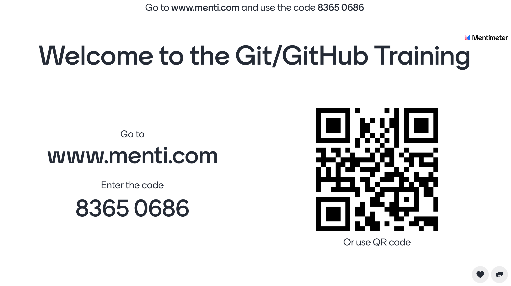

## Getting prepared for class2

## Where to get ppt slides?

- [PPT Slides: http://ppt.winson.li](http://ppt.winson.li)
- [PDF file: http://pdf.winson.li](http://pdf.winson.li)
- [PDF DayOneReview file: http://dayonereview.winson.li](http://dayonereview.winson.li)

## Who are suitable to join?

This course is designed for beginner of Git & GitHub and assumed student who don't have any experience in Git & GitHub. If you know Git command such as git branch, git checkout, git merge, you can save attention in day1 since we will go though Git command in 1st day. If you would like to go though approval process with teammates, 2nd day morning will be suitable for you. Also you can find blow agenda for which topic are interested.

### Learning Objectives of Git
- Explain Git and its core features.
- Apply different ways to undo changes made to a Git project.
- Describe when to use them.
- Create multiple versions of a project with branching.
- Demonstrate Git collaborations with remotes, pulling and pushing.

### Learning Objectives of GitHub
- Define GitHub
- Create and use a repository
- Start and manage a new branch
- Collaborate with others on GitHub
- Make changes to a file and push them to GitHub as commits
- Open and merge a pull request

### Day One Road Map
1. Introduction of Git & GitHub
1. Relationship between GitHub & Git
1. Basic command Git Workflow: git init, git add, git status, git commit, git log
1. How to Backtrack: restore file from commit
1. Git branch, merge, rebase
1. Resolve conflict during merge

### Day Two Road Map
1. Simple operation of GitHub: branch, pull request, merge pull request
1. How to control source code update on protected branch with story and case study
1. Go through rest of elements in http://winson.li
1. Organization setup about GitHub

Here are some links you should know to getting support or prepared before the class.

<!-- toc -->

### What is your breakout room number in zoom? What is your student ID?

For this class, we will use zoom for our meeting:

- Here is the class name list for showing your zoom breakout room number and your student ID.
[http://class2.winson.li](http://class2.winson.li)
- You can find your role in Zoom Breakout Room, such as developer, reviewer and approver. Please input your GitHub.com Account ID in Column D with yellow highlighted for replacing "tbc" and please replace with your GitHub.com Account ID in Zoom Display Name (Column G) with the "tbc"
- Please change your name in zoom "Participants" for letting your teammate & all helper knows which room will you join when you are disconnected zoom and back.
- This is name convention: (Student ID, Group#, Role, GitHub account) Name eg 
```(131, 18, developer, winsonliwh) Winson Li```
- **If your name cannot be found, your room number should be 18, student ID is any number between 200 and 300, default role is developer.**

### Where to reply questions, polls, quizzes? What is menti.com?

For this class, we use www.menti.com to get your answer for questions / polls / quizzes. 
 - Here is the URL with our code (8365 0686):
 [menti.com with code 8365 0686](https://www.menti.com/uar1cewy65)
 - Or you can visit [www.menti.com](https://www.menti.com/) and input the code (8365 0686) manually after open the web page.
 - It is highly recommend to use mobile to scran below QR Code.
 


---
### Gaming Tools & Interactive Cheat Sheet
We will use this interactive gaming tools to play with git command:
 - [https://learngitbranching.winson.li](https://learngitbranching.winson.li)
 - [https://ndpsoftware.com/git-cheatsheet.html](https://ndpsoftware.com/git-cheatsheet.html#loc=index)

---
### FAQ
#### What is the different between "master" branch & "main' branch?
- "master" is old name and "main" is new name. The main branch has already replaced all new github repos as the main branch. You can read up on it [here](https://github.com/github/renaming). There is no actual difference between main and master, it's just the name of the default branch.
#### Can we use Visual Studio Code instead of GitPod Code?
- Yes, sure as you have installed git while using Visual Studio Code.
#### Is it normal for the Gitpod long loading time with message "Pulling container image …"?
- Please wait few mins if we are clicking the same thing together.

#### Can you explain more about git diff staged HEAD?
- git diff --staged will only show changes to files in the "staged" area. git diff HEAD will show all changes to tracked files. If you have all changes staged for commit, then both commands will output the same.
#### What is the meaning of ‘origin’ in ‘origin/main’?
- The term "git origin main" is used in the context of a remote repository. It is used to deal with the remote repository. The term origin comes from **where repository original situated** and main stands for the main branch.

#### What is the diff between HEAD and master branches?
- The simple answer is that HEAD is a **pointer/label** to the most recent commit of the branch you are currently on. master is the default branch created when you initialized a git repository (e.g. git init ). You can delete the master branch (e.g. git branch -D master ). You cannot delete the HEAD pointer.

#### How to handle the configuration info or any sensitive info in git? Should we skip import them to GitHub? 
- [Cheat Sheet: 10 GitHub Security Best Practices](https://snyk.io/blog/ten-git-hub-security-best-practices/)

#### What are the advantages of Git over SVN? 
- [Difference Between GIT and SVN](https://www.geeksforgeeks.org/difference-between-git-and-svn/?ref=lbp)

#### What is the difference between fetch and pull?
- pull = fetch + merge; git fetch is the command that tells your local git to retrieve the latest meta-data info from the original (yet doesn't do any file transferring. It's more like just checking to see if there are any changes available). git pull on the other hand does that AND brings (copy) those changes from the remote repository.

#### What is the advantage of github over TortoiseGit? Is it only UI difference?
- **What is GitHub?** Powerful collaboration, review, and code management for open source and private development projects. GitHub is the best place to share code with friends, co-workers, classmates, and complete strangers. Over three million people use GitHub to build amazing things together.

- **What is TortoiseGit?** The Power of Git in a Windows Shell. It is a Git revision control client, implemented as a Windows shell extension and based on TortoiseSVN. It is free software released under the GNU General Public License.

- GitHub belongs to **"Code Collaboration & Version Control"** category of the tech stack, while **TortoiseGit can be primarily classified under "Git Tools"**.

#### What is the difference between ```git add .``` and ```git add -u```?
- ```git add .``` will ad everything in current directory.
- ```git add -u``` only adds currently tracked files (which have been modified) to the staging area and also checks if they have been deleted (if yes, they are removed from staging area). This means that it does not stage new files.


---
### Exploring

Congratulations! You should now have a room number. If you still have any issue, please use our WhatsApp support group:

- **[WhatsApp Support Group](https://chat.whatsapp.com/BYaHI6j9q34HbYRLRF0TpV)** - QA & Support during the class and after the class.

- **[Video play list for this course](https://www.youtube.com/watch?v=GBRIxmKRPGA&list=PLg7s6cbtAD16Pgp6WIVfX4VsGI-xyWkMz&index=4)** - 20 Videos including: 
What is GitHub,
Github Flow,
Working Locally,
Create Local Commits,
Open a Pull Request,
Merge the Pull Request,
Syncing the Local Repository,
Logs and Creating Aliases,
Introduction to Organizations, Forks and GitHub Pages,
Workflow Review,
Simple Conflict,
Fix the Game,
Merge Conflict with Multiple Remotes,
Crafting Atomic Commits,
Basics of Git Internals,
Reset,
Reflog and Cherry Pick,
Rebase and 
Commit Amend
